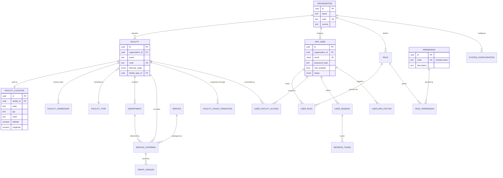
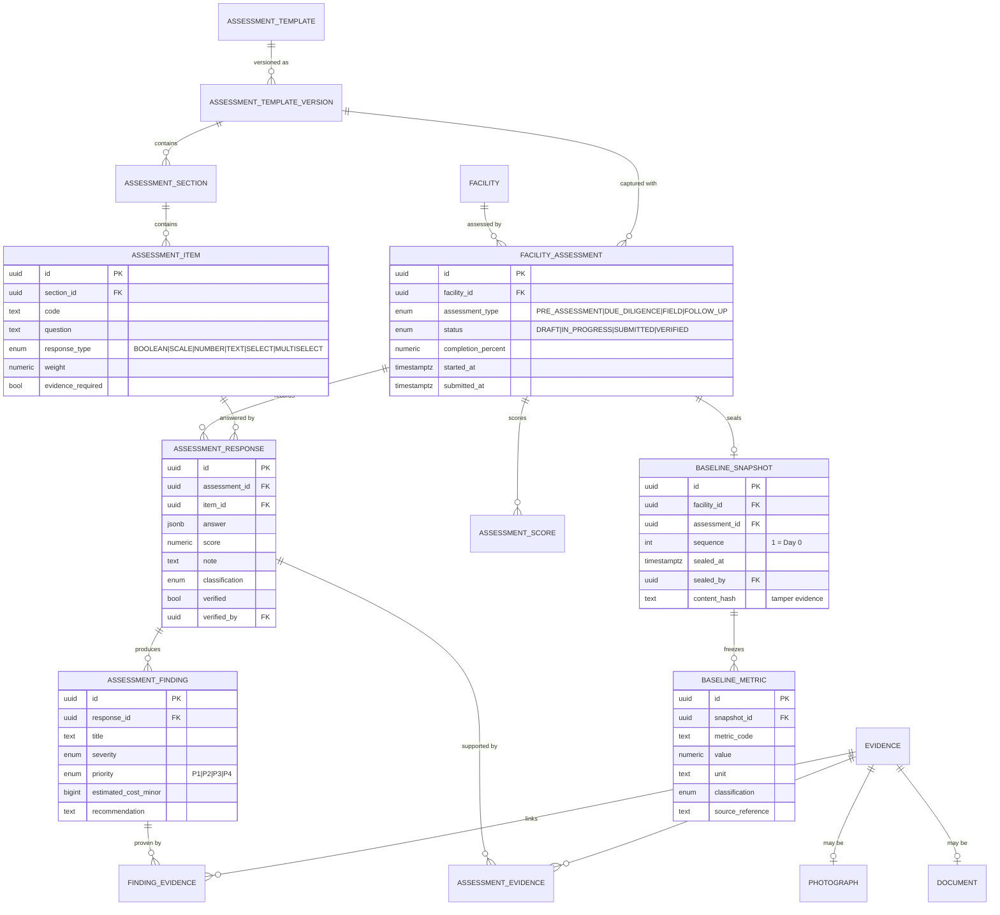
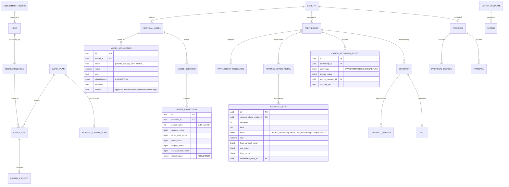
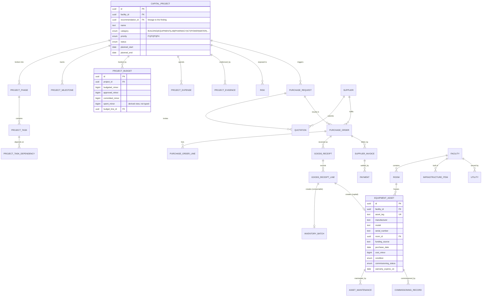
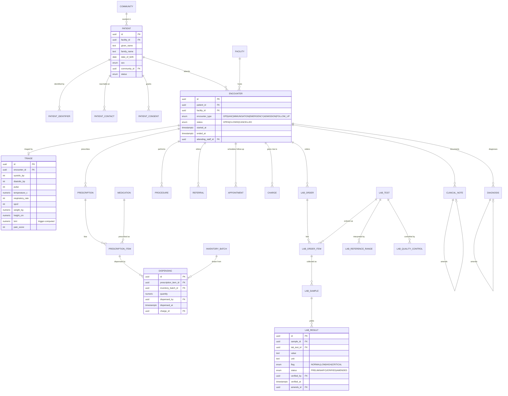
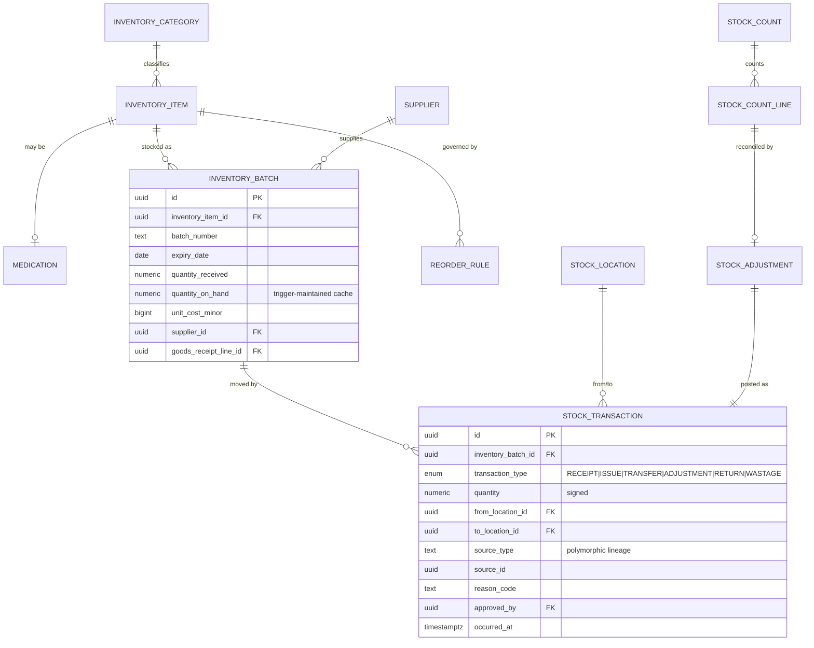
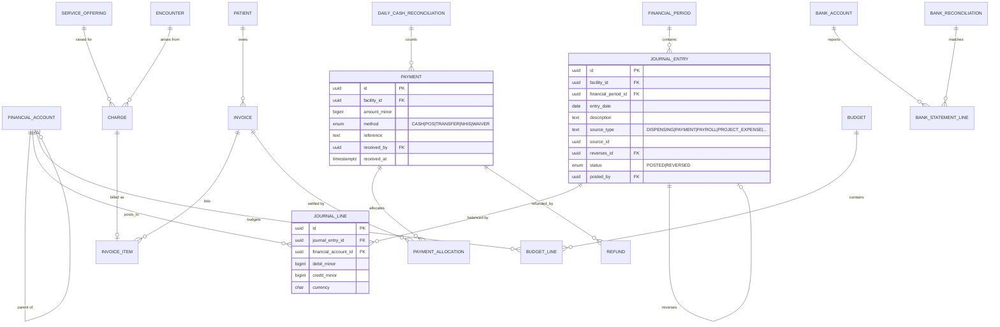
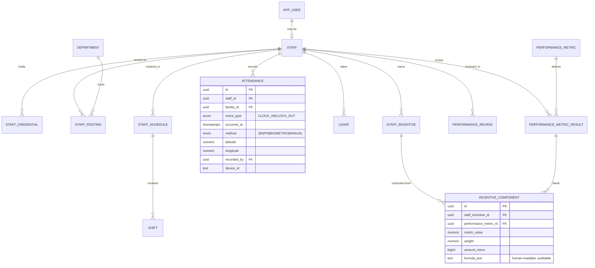
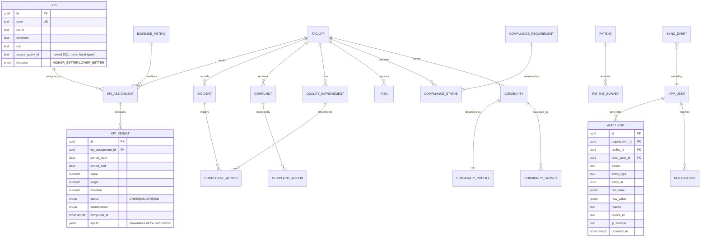

# 04 — Entity Relationship Diagram

The full schema is ~160 tables. A single diagram would be unreadable, so it is presented as nine
bounded contexts plus the cross-context join points that carry the data chain.

Notation: `||--o{` = one-to-many, `}o--o{` = many-to-many via a join table, `||--||` = one-to-one.
Every entity also carries the universal columns from `03-database-architecture.md` §1; they are
omitted here for legibility.

---

## 1. Core — tenancy, identity, access



---

## 2. Assessment, evidence, baseline



---

## 3. Planning — needs, CAPEX, financial model, partnership



---

## 4. Execution — projects, procurement, assets



---

## 5. Clinical — patient, encounter, laboratory, pharmacy



---

## 6. Supply chain — inventory and stock ledger



---

## 7. Finance



---

## 8. People — HR, attendance, performance



---

## 9. Quality, KPI, audit, community



---

## 10. The cross-context chain

These are the foreign keys that make the product's central claim provable. They cross bounded
contexts deliberately, and each is covered by an acceptance test.

| From | To | Column | Proves |
|---|---|---|---|
| `assessment_finding` | `need` | `need.finding_id` | Problem was observed, not invented |
| `recommendation` | `capital_project` | `capital_project.recommendation_id` | Spending traces to a finding |
| `capex_line` | `budget_line` | `budget_line.capex_line_id` | Budget traces to a plan |
| `purchase_order` | `capital_project` | `purchase_order.project_id` | Procurement traces to a project |
| `goods_receipt_line` | `equipment_asset` | `equipment_asset.goods_receipt_line_id` | Asset traces to a purchase |
| `equipment_asset` | `commissioning_record` | `commissioning_record.asset_id` | Asset became operational |
| `encounter` | `charge` | `charge.encounter_id` | Revenue traces to care delivered |
| `charge` | `invoice_item` → `invoice` → `payment` | allocation chain | Cash traces to a service |
| `payment` | `journal_entry` | `journal_entry.source_id` | Ledger traces to cash |
| `dispensing` | `stock_transaction` | `stock_transaction.source_id` | Stock movement traces to a patient |
| `attendance` | `performance_metric_result` | computed inputs | Performance traces to events |
| `journal_line` | `capital_recovery_event` | `capital_recovery_event.source_payment_id` | Partner return traces to real money |
| `baseline_metric` | `kpi_assignment` | `kpi_assignment.baseline_metric_id` | Today is comparable to Day 0 |

---

## 11. Generating the live diagram

The diagrams above are maintained by hand for readability. A generated, exhaustive diagram of the
actual schema is produced from the database and must be regenerated after every migration:

```bash
npm run db:erd        # renders docs/architecture/generated/erd-full.svg from the live schema
```

If the generated diagram and this document disagree, **the generated diagram is correct** and this
document is stale — fix it in the same pull request as the migration.
