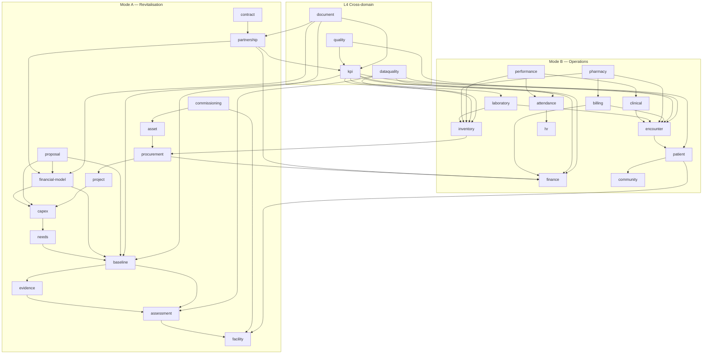

# 05 — Module Dependency Map

Dependencies are declared, acyclic, and enforced. A NestJS module that does not import another
module cannot call it. An ESLint boundary rule plus a CI check (`npm run check:boundaries`) fails
the build on any import that violates this map.

---

## 1. Layers

Dependencies flow **downward only**. A lower layer never imports an upper layer.

```
┌──────────────────────────────────────────────────────────────────────┐
│ L5  PRESENTATION / AGGREGATION                                       │
│     dashboard · reporting · analytics · ai · benchmarking · search    │
├──────────────────────────────────────────────────────────────────────┤
│ L4  CROSS-DOMAIN WORKFLOW                                            │
│     kpi · quality · partnership · document · dataquality · lineage    │
├──────────────────────────────────────────────────────────────────────┤
│ L3  DOMAIN                                                           │
│     assessment baseline needs capex financial-model proposal contract │
│     project procurement asset commissioning                           │
│     patient encounter clinical laboratory pharmacy                    │
│     inventory billing finance hr attendance performance community     │
├──────────────────────────────────────────────────────────────────────┤
│ L2  PLATFORM SERVICES                                                │
│     notification · storage · sync · config · outbox · scheduler       │
├──────────────────────────────────────────────────────────────────────┤
│ L1  FOUNDATION                                                       │
│     auth · identity · tenancy · rbac · audit · classification         │
├──────────────────────────────────────────────────────────────────────┤
│ L0  INFRASTRUCTURE                                                   │
│     prisma · redis · queue · logger · http · crypto                   │
└──────────────────────────────────────────────────────────────────────┘
```

**Invariants**

1. Every L3+ module depends on all of L1. This is automatic (global guards/interceptors), not
   per-module wiring.
2. No cycles. Where two domain modules genuinely need each other, one direction becomes a **domain
   event** rather than an import.
3. `finance` is imported by many modules but imports no domain module. It is the ledger; it accepts
   postings, it does not reach out.

---

## 2. Domain dependency graph



---

## 3. Dependency table

| Module | Layer | Imports (synchronous) | Listens to (events) | Publishes |
|---|---|---|---|---|
| `auth` | L1 | crypto, prisma, redis | — | `UserAuthenticated`, `SessionRevoked` |
| `identity` | L1 | prisma | — | `UserCreated`, `UserDisabled` |
| `tenancy` | L1 | prisma | — | — |
| `rbac` | L1 | prisma, redis | `UserRoleChanged` | `PermissionsInvalidated` |
| `audit` | L1 | prisma | all | — |
| `classification` | L1 | — | — | — |
| `storage` | L2 | s3, crypto | — | `ObjectStored` |
| `notification` | L2 | prisma, queue, outbox | many | `NotificationDispatched` |
| `sync` | L2 | prisma, redis | — | `SyncBatchApplied`, `ConflictRaised` |
| `config` | L2 | prisma, redis | — | `ConfigurationChanged` |
| `facility` | L3 | identity, config | `BaselineSealed`, `CommissioningSigned` | `FacilityStageChanged` |
| `assessment` | L3 | facility, storage, config | — | `AssessmentSubmitted`, `FindingRaised` |
| `evidence` | L3 | storage, assessment | — | `EvidenceVerified` |
| `baseline` | L3 | assessment, evidence | `AssessmentSubmitted` | `BaselineSealed` |
| `needs` | L3 | baseline, assessment | `BaselineSealed` | `NeedIdentified` |
| `capex` | L3 | needs, config | `NeedIdentified` | `CapexLineApproved` |
| `financial-model` | L3 | capex, baseline, config | `CapexLineApproved` | `ModelApproved`, `AssumptionChanged` |
| `partnership` | L3 | financial-model, finance | `PaymentPosted`, `ModelApproved` | `WaterfallComputed` |
| `proposal` | L3 | baseline, capex, financial-model, document | — | `ProposalApproved` |
| `contract` | L3 | partnership, document | `ProposalApproved` | `ContractExecuted` |
| `project` | L3 | capex, finance | `CapexLineApproved` | `ProjectCompleted`, `TaskCompleted` |
| `procurement` | L3 | project, finance, inventory, asset | — | `GoodsReceived`, `PoIssued` |
| `asset` | L3 | procurement, facility | `GoodsReceived` | `AssetCreated` |
| `commissioning` | L3 | asset, project | `ProjectCompleted` | `CommissioningSigned` |
| `patient` | L3 | facility, community | — | `PatientRegistered` |
| `encounter` | L3 | patient, hr | — | `EncounterOpened`, `EncounterClosed` |
| `clinical` | L3 | encounter | — | `DiagnosisRecorded`, `NoteAmended` |
| `laboratory` | L3 | encounter, inventory, billing | — | `LabResultVerified`, `CriticalResult` |
| `pharmacy` | L3 | encounter, inventory, billing | — | `DispensingCompleted` |
| `inventory` | L3 | config | `GoodsReceived` | `StockTransactionPosted`, `StockAlert` |
| `billing` | L3 | encounter, config(tariff), finance | `EncounterClosed` | `ChargeRaised`, `InvoiceIssued` |
| `finance` | L3 | config(chart of accounts) | `ChargeRaised`, `PaymentReceived` | `PaymentPosted`, `PeriodClosed` |
| `hr` | L3 | identity, facility | — | `StaffPosted`, `CredentialExpiring` |
| `attendance` | L3 | hr | — | `AttendanceRecorded` |
| `performance` | L3 | attendance, clinical, inventory, config | `AttendanceRecorded` | `IncentiveComputed` |
| `community` | L3 | facility | — | `SurveyCompleted` |
| `kpi` | L4 | analytics SQL only (read) | many | `KpiComputed` |
| `quality` | L4 | encounter, kpi | `CriticalResult`, `ComplaintRaised` | `QualityActionRaised` |
| `document` | L4 | all read-models | — | `DocumentGenerated`, `DocumentApproved` |
| `dataquality` | L4 | read-models | scheduled | `DataQualityScored` |
| `lineage` | L4 | read-models | — | — |
| `dashboard` | L5 | kpi, analytics | — | — |
| `reporting` | L5 | analytics, document | — | — |
| `analytics` | L5 | SQL read-models | — | — |
| `benchmarking` | L5 | analytics | — | — |
| `search` | L5 | rbac + read-models | — | — |
| `ai` | L5 | analytics (read-only role) | — | `InsightGenerated` |

---

## 4. Deliberately broken cycles

Three pairs of modules would naturally form cycles. Each is broken by an event, and the reason is
recorded so a future developer does not "fix" it by adding the import back.

| Apparent cycle | Resolution | Why |
|---|---|---|
| `billing ↔ finance` | `billing` imports `finance`; `finance` reacts to `ChargeRaised` via event | The ledger must not know about clinical billing rules |
| `pharmacy ↔ inventory` | `pharmacy` imports `inventory`; `inventory` raises `StockAlert` via event | Inventory must serve lab, procurement and pharmacy identically |
| `project ↔ procurement` | `procurement` imports `project`; `project` reacts to `GoodsReceived` | A project may exist without procurement (e.g. labour-only) |

---

## 5. Frontend module structure

The web application mirrors the server module boundaries so that a permission, a route, and a
service module line up one-to-one.

```
apps/web/src/
  app/                    router, providers, error boundaries, service worker registration
  design-system/          tokens, primitives, layout, data-display, forms, feedback
  lib/                    api client, auth, offline db, sync engine, permissions, formatting
  features/
    auth/  facility/  assessment/  evidence/  baseline/  needs/  capex/
    financial-model/  partnership/  proposal/  contract/  project/  procurement/
    asset/  patient/  encounter/  clinical/  laboratory/  pharmacy/  inventory/
    billing/  finance/  hr/  attendance/  performance/  quality/  kpi/
    dashboard/  reporting/  admin/
  routes/                 route definitions; each declares its required permission
```

Each feature folder contains `api.ts` (typed calls against `packages/contracts`), `hooks.ts`
(TanStack Query), `components/`, `pages/`, and `offline.ts` where the feature is offline-capable.

**Route-level code splitting is mandatory.** A CHEW on a 3G link must never download the finance,
partnership, or analytics bundles. Enforced by a bundle-size budget in CI.

---

## 6. Shared contracts package

`packages/contracts` is the only module both tiers import. It contains:

- Zod schemas for every request and response body
- Inferred TypeScript types
- Enumerations shared by database, API and UI
- The permission code catalogue
- Classification rules and the aggregate-weakening function
- Money helpers (minor-unit arithmetic, formatting)

It has **no runtime dependencies on Nest, React, Prisma, or the database**. That is what lets the
same validation run in a village with no signal and on the server at sync time.
